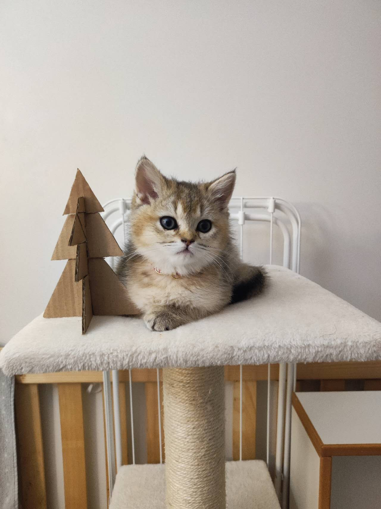
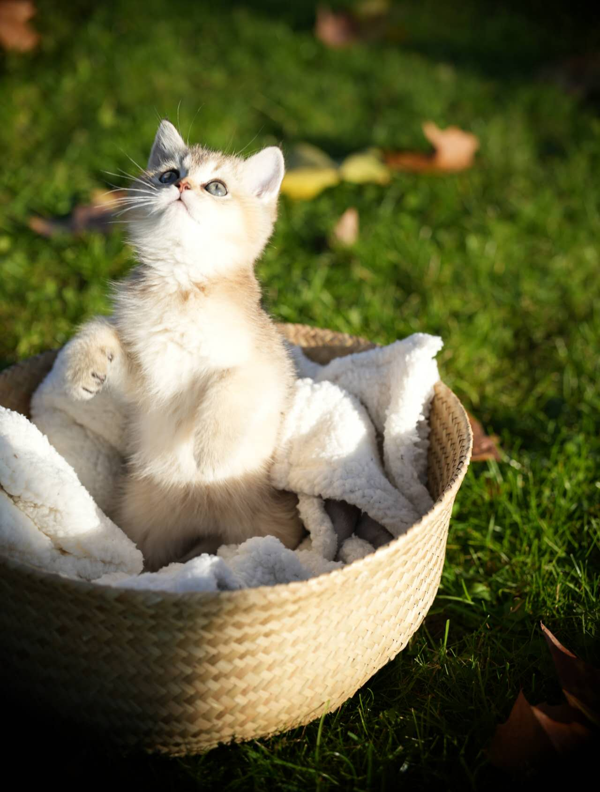
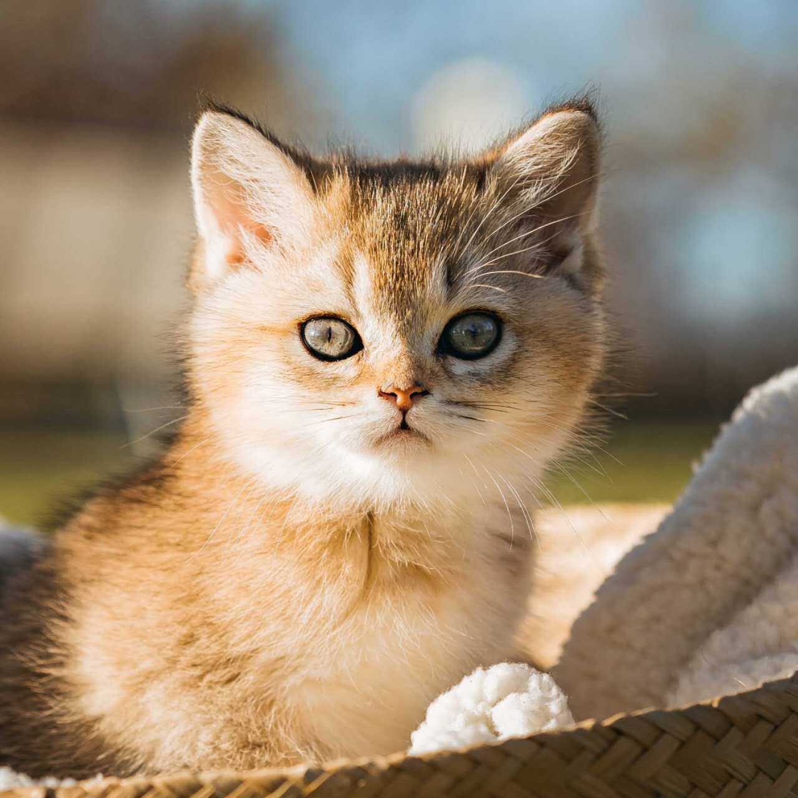
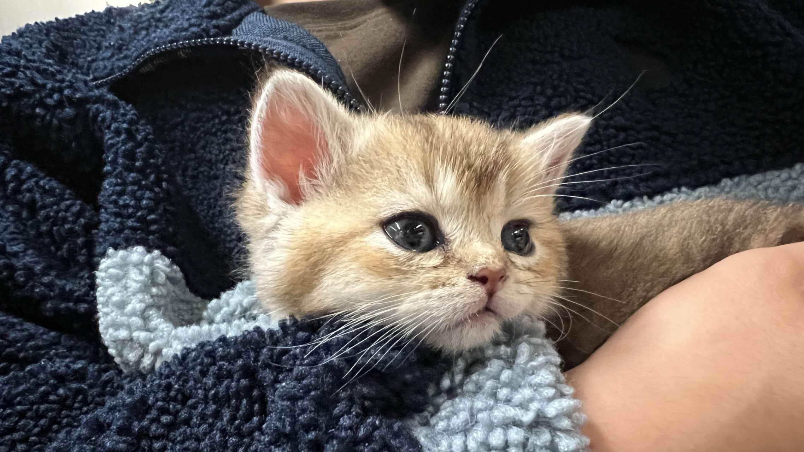
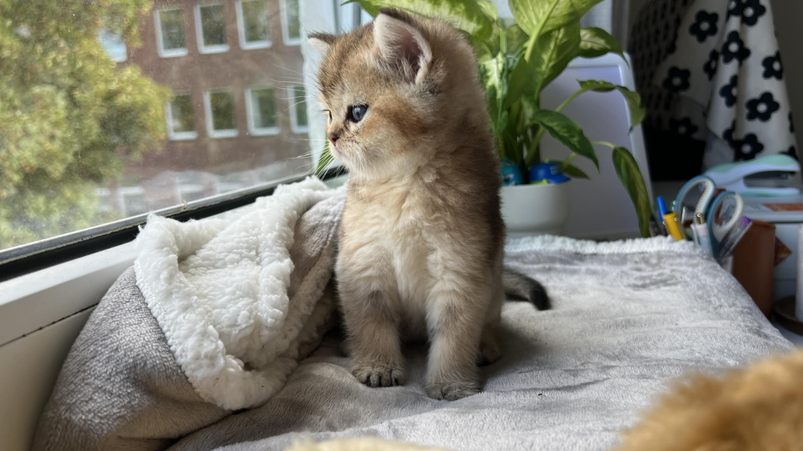
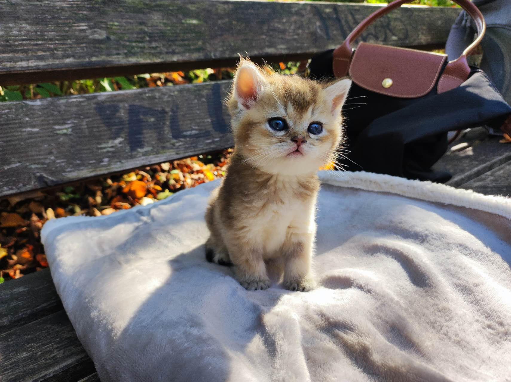
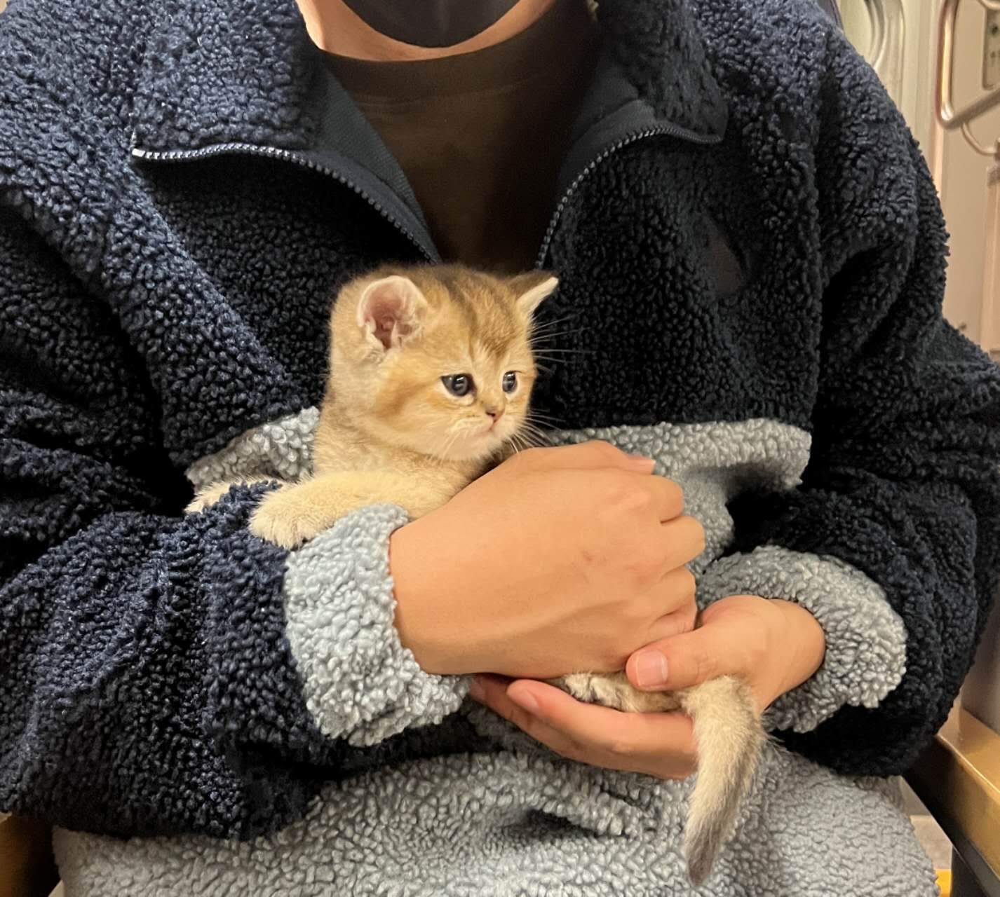

---

title: Blog 1

---

## 小猫挞挞的相册 Kitten Tata's photo album

挞挞是我的第一个宠物，可惜他已经不在我身边，我现在每天都十分想念他。

挞挞的女朋友Titi是一只更加粘人的虎斑金渐层，她也跟着挞挞一起走了，我也十分想念她。

希望他们俩可以一直幸福的生活在一起。

挞挞是一只金渐层英短猫，名字取自德语的城市“Stadt”的中间音节。在中文中，他也可以被称为蛋挞，和他的毛色相对应。

Tata is a golden gradient British shorthair cat whose name comes from the middle syllable of the German word city "Stadt". In Chinese, he can also be called "Danta" (Egg Tart), corresponding to his coat color.

